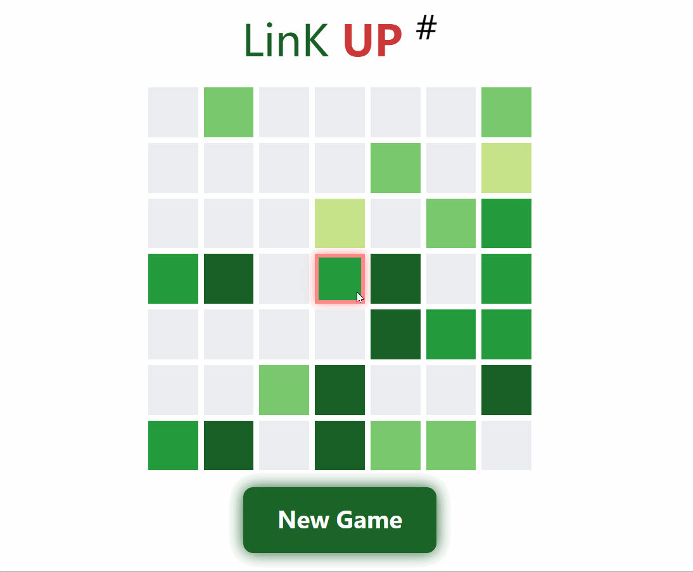

## link-up
A small game **link-up** v2js.com/link-up/

## Demo

<a href="http://www.v2js.com/link-up/">

</a>


## Quick Start

install：
```
npm i linkup-game -S
```

or link the script in your html document:

```html
<script src="https://unpkg.com/linkup-game@1.0.0/dist/linkup.min.js"></script>
```

use like this:

```js
new Matrix(7, 0.3).$mount(
    document.getElementById('app')
)
```

## Known Bug

1. Oh my Gad! This game is temporarily unavailable to use on mobile devices ... 😐

2. A bug that exists when deselecting